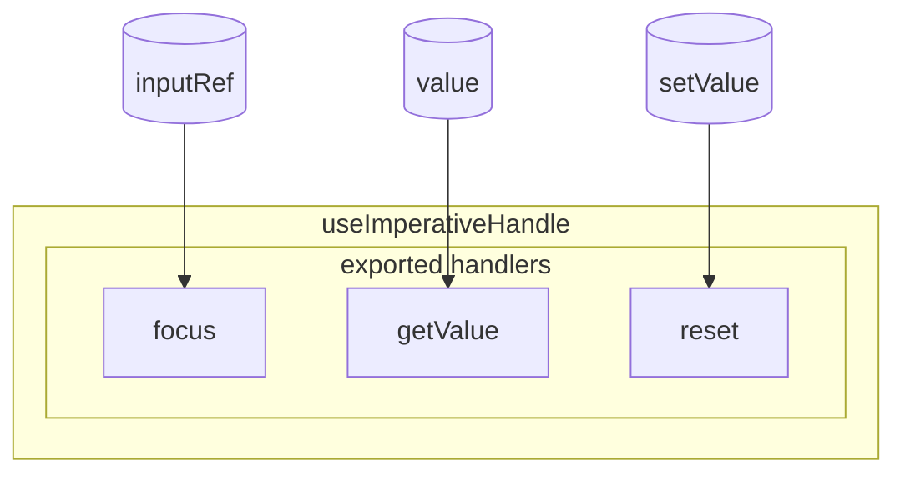

# Design Document

## Overview

This design enhances the React Parser DFD generation to provide detailed visualization of `useImperativeHandle` hook usage. Currently, `useImperativeHandle` is treated as a single process node. This enhancement will extract individual methods defined within the hook's factory function and create a subgroup called "exported handlers" that contains these methods as separate process nodes with their own data flow connections.

The design follows the existing subgraph pattern used for JSX conditional rendering, adapting it to represent imperative handle methods that are exposed to parent components through refs.

## Architecture

### High-Level Architecture

```
┌─────────────────────────────────────────────────────────────┐
│  useImperativeHandle Hook Call                              │
│  ┌───────────────────────────────────────────────────────┐  │
│  │  Factory Function                                     │  │
│  │  ┌─────────────────────────────────────────────────┐ │  │
│  │  │  Returned Object                                │ │  │
│  │  │  - focus: () => { ... }                         │ │  │
│  │  │  - getValue: () => { ... }                      │ │  │
│  │  │  - reset: () => { ... }                         │ │  │
│  │  └─────────────────────────────────────────────────┘ │  │
│  └───────────────────────────────────────────────────────┘  │
└─────────────────────────────────────────────────────────────┘
                          │
                          ▼
┌─────────────────────────────────────────────────────────────┐
│  DFD Representation                                         │
│  ┌───────────────────────────────────────────────────────┐  │
│  │  useImperativeHandle (Process Node)                  │  │
│  │  ┌─────────────────────────────────────────────────┐ │  │
│  │  │  Subgroup: "exported handlers"                  │ │  │
│  │  │  - focus (exported-handler)                     │ │  │
│  │  │  - getValue (exported-handler)                  │ │  │
│  │  │  - reset (exported-handler)                     │ │  │
│  │  └─────────────────────────────────────────────────┘ │  │
│  └───────────────────────────────────────────────────────┘  │
└─────────────────────────────────────────────────────────────┘
```

### Module Structure

```
src/
├── analyzers/
│   ├── process-analyzer.ts        # Enhanced to extract exported handlers
│   ├── imperative-handle-analyzer.ts  # NEW: Dedicated analyzer for useImperativeHandle
│   └── subgraph-builder.ts        # Enhanced to support exported handler subgroups
├── parser/
│   ├── dfd-builder.ts             # Enhanced to create subgroups for exported handlers
│   └── types.ts                   # Enhanced with new types
└── test/
    └── dfd-imperative-handle.test.ts  # Enhanced with subgraph tests
```

## Components and Interfaces

### 1. Enhanced ProcessInfo Type


```typescript
// In src/parser/types.ts

export interface ProcessInfo {
  name: string;
  type: 'useEffect' | 'useLayoutEffect' | 'useInsertionEffect' | 
        'useCallback' | 'useMemo' | 'useImperativeHandle' | 
        'event-handler' | 'custom-function' | 'cleanup' | 
        'exported-handler';  // NEW: Type for exported handlers
  dependencies?: string[];
  references: string[];
  externalCalls: ExternalCallInfo[];
  line?: number;
  column?: number;
  cleanupProcess?: ProcessInfo;
  isInlineHandler?: boolean;
  usedInJSXElement?: { line?: number; column?: number; attributeName?: string };
  
  // NEW: For useImperativeHandle
  exportedHandlers?: ExportedHandlerInfo[];  // Methods exposed through the hook
  parentProcessId?: string;  // Reference to parent useImperativeHandle process
}

export interface ExportedHandlerInfo {
  name: string;  // Method name (e.g., 'focus', 'getValue')
  parameters?: string[];  // Parameter names
  references: string[];  // Variables referenced in the method body
  externalCalls: ExternalCallInfo[];  // External calls made by the method
  returnsValue: boolean;  // Whether the method returns a value
  isAsync: boolean;  // Whether the method is async
  line?: number;
  column?: number;
}
```

### 2. Enhanced DFDSubgraph Type

```typescript
// In src/parser/types.ts

export interface DFDSubgraph {
  id: string;
  label: string;
  type: 'jsx-output' | 'conditional' | 'exported-handlers';  // NEW: exported-handlers type
  condition?: ConditionExpression;
  elements: (DFDNode | DFDSubgraph)[];
  parentProcessId?: string;  // NEW: Reference to parent useImperativeHandle process
}
```

### 3. ImperativeHandleAnalyzer Interface

```typescript
// In src/analyzers/imperative-handle-analyzer.ts

export interface ImperativeHandleAnalyzer {
  /**
   * Analyze useImperativeHandle hook to extract exported handlers
   * @param callExpression - The useImperativeHandle call expression
   * @returns Array of ExportedHandlerInfo objects
   */
  analyzeImperativeHandle(callExpression: swc.CallExpression): ExportedHandlerInfo[];
  
  /**
   * Extract method definitions from factory function
   * @param factoryFunction - The factory function (second argument)
   * @returns Array of method definitions
   */
  extractMethodDefinitions(
    factoryFunction: swc.ArrowFunctionExpression | swc.FunctionExpression
  ): ExportedHandlerInfo[];
}
```


## Data Models

### Factory Function Patterns

The analyzer must handle various patterns for defining methods in `useImperativeHandle`:

**Pattern 1: Arrow Function with Object Expression**
```typescript
useImperativeHandle(ref, () => ({
  focus: () => { inputRef.current?.focus(); },
  getValue: () => value,
  reset: () => { setValue(''); }
}));
```

**Pattern 2: Arrow Function with Block Statement**
```typescript
useImperativeHandle(ref, () => {
  return {
    focus: () => { inputRef.current?.focus(); },
    getValue: () => value
  };
});
```

**Pattern 3: Regular Function**
```typescript
useImperativeHandle(ref, function() {
  return {
    focus: () => { inputRef.current?.focus(); }
  };
});
```

**Pattern 4: Method Shorthand**
```typescript
useImperativeHandle(ref, () => ({
  focus() { inputRef.current?.focus(); },
  getValue() { return value; }
}));
```

**Pattern 5: Function Expression Properties**
```typescript
useImperativeHandle(ref, () => ({
  focus: function() { inputRef.current?.focus(); }
}));
```

### Method Definition Extraction Algorithm

```typescript
function extractMethodDefinitions(factoryFunction): ExportedHandlerInfo[] {
  // 1. Get the factory function body
  const body = getFactoryFunctionBody(factoryFunction);
  
  // 2. Find the returned object expression
  const objectExpression = findReturnedObject(body);
  
  if (!objectExpression) {
    return [];
  }
  
  // 3. Extract each property as a method
  const methods: ExportedHandlerInfo[] = [];
  
  for (const property of objectExpression.properties) {
    if (property.type === 'KeyValueProperty') {
      const methodName = getPropertyKey(property.key);
      const methodFunction = property.value;
      
      if (isFunctionLike(methodFunction)) {
        const methodInfo = analyzeMethod(methodName, methodFunction);
        methods.push(methodInfo);
      }
    }
    else if (property.type === 'MethodProperty') {
      const methodName = getPropertyKey(property.key);
      const methodInfo = analyzeMethod(methodName, property);
      methods.push(methodInfo);
    }
  }
  
  return methods;
}
```

### Data Flow Edge Creation Rules

**Rule 1: State Variable to Exported Handler**
- When an exported handler references a state variable (from useState/useReducer)
- Create edge: `data-store` → `exported-handler`
- Example: `getValue: () => value` creates edge from `value` data store to `getValue` handler

**Rule 2: Exported Handler to State Setter**
- When an exported handler calls a state setter function
- Create edge: `exported-handler` → `data-store`
- Example: `reset: () => setValue('')` creates edge from `reset` handler to `value` data store

**Rule 3: Prop to Exported Handler**
- When an exported handler references a prop
- Create edge: `external-entity-input` → `exported-handler`
- Example: `submit: () => onSubmit(value)` creates edge from `onSubmit` prop to `submit` handler

**Rule 4: Context to Exported Handler**
- When an exported handler references a context value
- Create edge: `external-entity-input` (or `data-store`) → `exported-handler`
- Example: `logout: () => auth.logout()` creates edge from `auth` context to `logout` handler

**Rule 5: Exported Handler to External Call**
- When an exported handler makes an external function call
- Create edge: `exported-handler` → `external-entity-output`
- Example: `save: () => api.save(value)` creates edge from `save` handler to `api.save` external call

**Rule 6: Exported Handler to Another Process**
- When an exported handler calls another function in the component
- Create edge: `exported-handler` → `process`
- Example: `submit: () => handleSubmit()` creates edge from `submit` handler to `handleSubmit` process


## Implementation Details

### 1. ImperativeHandleAnalyzer Implementation

```typescript
// src/analyzers/imperative-handle-analyzer.ts

export class SWCImperativeHandleAnalyzer implements ImperativeHandleAnalyzer {
  private sourceCode: string = '';
  private lineStarts: number[] = [];

  setSourceCode(sourceCode: string): void {
    this.sourceCode = sourceCode;
    this.lineStarts = this.calculateLineStarts(sourceCode);
  }

  analyzeImperativeHandle(callExpression: swc.CallExpression): ExportedHandlerInfo[] {
    // Get the factory function (second argument)
    if (callExpression.arguments.length < 2) {
      return [];
    }

    const factoryArg = callExpression.arguments[1];
    if (factoryArg.spread) {
      return [];
    }

    const factoryFunction = factoryArg.expression;
    if (factoryFunction.type !== 'ArrowFunctionExpression' && 
        factoryFunction.type !== 'FunctionExpression') {
      return [];
    }

    return this.extractMethodDefinitions(factoryFunction);
  }

  extractMethodDefinitions(
    factoryFunction: swc.ArrowFunctionExpression | swc.FunctionExpression
  ): ExportedHandlerInfo[] {
    const objectExpression = this.findReturnedObject(factoryFunction);
    
    if (!objectExpression) {
      return [];
    }

    const methods: ExportedHandlerInfo[] = [];

    for (const property of objectExpression.properties) {
      const methodInfo = this.extractMethodFromProperty(property);
      if (methodInfo) {
        methods.push(methodInfo);
      }
    }

    return methods;
  }

  private findReturnedObject(
    func: swc.ArrowFunctionExpression | swc.FunctionExpression
  ): swc.ObjectExpression | null {
    // Handle arrow function with expression body: () => ({ ... })
    if (func.type === 'ArrowFunctionExpression' && 
        func.body.type === 'ObjectExpression') {
      return func.body;
    }

    // Handle function with block statement body
    if (func.body && func.body.type === 'BlockStatement') {
      // Find return statement
      for (const statement of func.body.stmts) {
        if (statement.type === 'ReturnStatement' && 
            statement.argument?.type === 'ObjectExpression') {
          return statement.argument;
        }
      }
    }

    return null;
  }

  private extractMethodFromProperty(
    property: swc.Property | swc.SpreadElement
  ): ExportedHandlerInfo | null {
    // Handle KeyValueProperty: { focus: () => {...} }
    if (property.type === 'KeyValueProperty') {
      const methodName = this.getPropertyKey(property.key);
      if (!methodName) return null;

      const methodFunction = property.value;
      if (this.isFunctionLike(methodFunction)) {
        return this.analyzeMethod(methodName, methodFunction, property);
      }
    }
    
    // Handle MethodProperty: { focus() {...} }
    else if (property.type === 'MethodProperty') {
      const methodName = this.getPropertyKey(property.key);
      if (!methodName) return null;

      return this.analyzeMethodProperty(methodName, property);
    }

    return null;
  }

  private analyzeMethod(
    name: string,
    func: swc.Expression,
    property: swc.Property
  ): ExportedHandlerInfo | null {
    if (func.type !== 'ArrowFunctionExpression' && 
        func.type !== 'FunctionExpression') {
      return null;
    }

    const parameters = this.extractParameters(func.params);
    const { references, externalCalls } = this.analyzeFunctionBody(func);
    const returnsValue = this.checkReturnsValue(func);
    const isAsync = func.async || false;

    return {
      name,
      parameters,
      references,
      externalCalls,
      returnsValue,
      isAsync,
      line: property.span?.start ? this.getLineNumber(property.span.start) : undefined,
      column: property.span?.start ? this.getColumnNumber(property.span.start) : undefined,
    };
  }

  private analyzeFunctionBody(
    func: swc.ArrowFunctionExpression | swc.FunctionExpression
  ): { references: string[]; externalCalls: ExternalCallInfo[] } {
    // Reuse logic from ProcessAnalyzer
    const references = new Set<string>();
    const externalCalls: ExternalCallInfo[] = [];

    if (func.body.type !== 'BlockStatement') {
      this.extractReferencesFromExpression(func.body, references, externalCalls);
    } else {
      this.extractReferencesFromBlockStatement(func.body, references, externalCalls);
    }

    return {
      references: Array.from(references),
      externalCalls,
    };
  }

  // ... (other helper methods similar to ProcessAnalyzer)
}
```

### 2. Enhanced ProcessAnalyzer

```typescript
// src/analyzers/process-analyzer.ts

export class SWCProcessAnalyzer implements ProcessAnalyzer {
  private imperativeHandleAnalyzer: ImperativeHandleAnalyzer;

  constructor() {
    this.imperativeHandleAnalyzer = new SWCImperativeHandleAnalyzer();
  }

  private extractProcessFromHook(declaration: swc.VariableDeclarator): ProcessInfo | null {
    // ... existing code ...

    // Special handling for useImperativeHandle
    if (hookName === 'useImperativeHandle') {
      const exportedHandlers = this.imperativeHandleAnalyzer.analyzeImperativeHandle(callExpression);
      
      return {
        name: name || hookName,
        type: 'useImperativeHandle',
        dependencies,
        references,
        externalCalls,
        exportedHandlers,  // NEW: Include exported handlers
        line,
        column,
      };
    }

    // ... rest of existing code ...
  }
}
```


### 3. Enhanced DFDBuilder

```typescript
// src/parser/dfd-builder.ts

export class DefaultDFDBuilder implements DFDBuilder {
  build(analysis: ComponentAnalysis): DFDSourceData {
    const nodes: DFDNode[] = [];
    const edges: DFDEdge[] = [];
    const subgraphs: DFDSubgraph[] = [];

    // ... existing code for props, hooks, etc. ...

    // Process processes (including useImperativeHandle)
    for (const process of analysis.processes) {
      if (process.type === 'useImperativeHandle' && process.exportedHandlers) {
        // Create parent useImperativeHandle node
        const parentNode = this.createProcessNode(process);
        nodes.push(parentNode);

        // Create subgroup for exported handlers
        const subgroup = this.createExportedHandlersSubgroup(process, parentNode.id);
        subgraphs.push(subgroup);

        // Create nodes for each exported handler
        for (const handler of process.exportedHandlers) {
          const handlerNode = this.createExportedHandlerNode(handler, parentNode.id);
          subgroup.elements.push(handlerNode);

          // Create edges for handler data flows
          this.createExportedHandlerEdges(handler, handlerNode, nodes, edges);
        }
      } else {
        // Regular process handling
        const processNode = this.createProcessNode(process);
        nodes.push(processNode);
        // ... existing edge creation ...
      }
    }

    return { nodes, edges, subgraphs };
  }

  private createExportedHandlersSubgroup(
    process: ProcessInfo,
    parentId: string
  ): DFDSubgraph {
    return {
      id: `${parentId}-exported-handlers`,
      label: 'exported handlers',
      type: 'exported-handlers',
      elements: [],
      parentProcessId: parentId,
    };
  }

  private createExportedHandlerNode(
    handler: ExportedHandlerInfo,
    parentId: string
  ): DFDNode {
    return {
      id: `${parentId}-handler-${handler.name}`,
      label: handler.name,
      type: 'process',
      line: handler.line,
      column: handler.column,
      metadata: {
        processType: 'exported-handler',
        parentProcessId: parentId,
        parameters: handler.parameters,
        returnsValue: handler.returnsValue,
        isAsync: handler.isAsync,
      },
    };
  }

  private createExportedHandlerEdges(
    handler: ExportedHandlerInfo,
    handlerNode: DFDNode,
    nodes: DFDNode[],
    edges: DFDEdge[]
  ): void {
    // Create edges from referenced variables to handler
    for (const ref of handler.references) {
      const sourceNode = this.findNodeByName(ref, nodes);
      if (sourceNode) {
        edges.push({
          from: sourceNode.id,
          to: handlerNode.id,
          label: 'reads',
        });
      }
    }

    // Create edges from handler to external calls
    for (const call of handler.externalCalls) {
      const callNode = this.createOrFindExternalCallNode(call, nodes);
      edges.push({
        from: handlerNode.id,
        to: callNode.id,
        label: 'calls',
      });

      // Create edges from arguments to external call
      for (const arg of call.arguments) {
        const argNode = this.findNodeByName(arg, nodes);
        if (argNode) {
          edges.push({
            from: argNode.id,
            to: callNode.id,
            label: 'passes',
          });
        }
      }
    }
  }
}
```

### 4. Enhanced SubgraphBuilder

```typescript
// src/analyzers/subgraph-builder.ts

export class SubgraphBuilder {
  /**
   * Build exported handlers subgraph for visualization
   */
  buildExportedHandlersSubgraph(
    process: ProcessInfo,
    parentNodeId: string
  ): DFDSubgraph | null {
    if (!process.exportedHandlers || process.exportedHandlers.length === 0) {
      return null;
    }

    const subgraph: DFDSubgraph = {
      id: `${parentNodeId}-exported-handlers`,
      label: 'exported handlers',
      type: 'exported-handlers',
      elements: [],
      parentProcessId: parentNodeId,
    };

    for (const handler of process.exportedHandlers) {
      const handlerNode: DFDNode = {
        id: `${parentNodeId}-handler-${handler.name}`,
        label: handler.name,
        type: 'process',
        line: handler.line,
        column: handler.column,
        metadata: {
          processType: 'exported-handler',
          parentProcessId: parentNodeId,
          parameters: handler.parameters,
          returnsValue: handler.returnsValue,
          isAsync: handler.isAsync,
        },
      };

      subgraph.elements.push(handlerNode);
    }

    return subgraph;
  }
}
```


## Visualization Integration

### Mermaid Diagram Representation

The exported handlers subgroup will be represented in Mermaid as a subgraph:



### Vis.js Network Representation

For vis.js visualization, exported handlers will be grouped visually:

```typescript
// Visualization configuration
{
  nodes: [
    {
      id: 'useImperativeHandle-1',
      label: 'useImperativeHandle',
      group: 'process',
      level: 2
    },
    {
      id: 'useImperativeHandle-1-handler-focus',
      label: 'focus',
      group: 'exported-handler',
      level: 3,
      parentId: 'useImperativeHandle-1'
    },
    {
      id: 'useImperativeHandle-1-handler-getValue',
      label: 'getValue',
      group: 'exported-handler',
      level: 3,
      parentId: 'useImperativeHandle-1'
    }
  ],
  edges: [
    // Data flows to/from exported handlers
  ]
}
```

### HTML Content Generator Enhancement

```typescript
// src/visualization/html-content-generator.ts

export class HTMLContentGenerator {
  private generateVisJsGroups(): string {
    return `
      groups: {
        'exported-handler': {
          shape: 'box',
          color: {
            background: '#E8F5E9',
            border: '#4CAF50',
            highlight: {
              background: '#C8E6C9',
              border: '#388E3C'
            }
          },
          font: {
            color: '#1B5E20',
            size: 12
          }
        },
        // ... other groups ...
      }
    `;
  }

  private generateHierarchicalLayout(): string {
    return `
      layout: {
        hierarchical: {
          enabled: true,
          levelSeparation: 150,
          nodeSpacing: 100,
          treeSpacing: 200,
          blockShifting: true,
          edgeMinimization: true,
          parentCentralization: true,
          direction: 'UD',
          sortMethod: 'directed'
        }
      }
    `;
  }
}
```

## Error Handling

### Error Scenarios

1. **Factory Function Not Found**
   - Fallback: Treat as regular useImperativeHandle process without subgroup
   - Log warning: "Could not extract factory function from useImperativeHandle"

2. **Invalid Object Expression**
   - Fallback: Treat as regular useImperativeHandle process
   - Log warning: "Factory function does not return an object expression"

3. **Method Extraction Failure**
   - Fallback: Skip the problematic method, continue with others
   - Log warning: "Could not extract method: {methodName}"

4. **Circular References**
   - Detection: Track visited nodes during reference extraction
   - Fallback: Stop traversal at circular reference point
   - Log warning: "Circular reference detected in exported handler"

### Graceful Degradation

```typescript
try {
  const exportedHandlers = this.imperativeHandleAnalyzer.analyzeImperativeHandle(callExpression);
  
  if (exportedHandlers.length > 0) {
    return {
      // ... with exportedHandlers
    };
  }
} catch (error) {
  console.warn('Failed to analyze useImperativeHandle exported handlers:', error);
  // Fall back to regular process handling
}

return {
  // ... without exportedHandlers
};
```


## Testing Strategy

### Unit Tests

1. **ImperativeHandleAnalyzer Tests**
   - Extract methods from arrow function with object expression
   - Extract methods from arrow function with block statement
   - Extract methods from regular function
   - Handle method shorthand syntax
   - Handle function expression properties
   - Extract parameters from methods
   - Detect async methods
   - Detect methods that return values
   - Handle empty factory functions
   - Handle non-object return values

2. **Method Reference Extraction Tests**
   - Extract state variable references
   - Extract state setter references
   - Extract prop references
   - Extract context references
   - Extract ref references
   - Extract nested function calls
   - Handle conditional logic in methods
   - Handle async/await expressions

3. **External Call Detection Tests**
   - Detect external function calls in methods
   - Extract arguments passed to external calls
   - Handle chained method calls (e.g., `api.user.save()`)
   - Distinguish between internal and external calls

4. **DFDBuilder Tests**
   - Create exported handlers subgroup
   - Create exported handler nodes
   - Create edges from state to handlers
   - Create edges from handlers to state setters
   - Create edges from props to handlers
   - Create edges from handlers to external calls
   - Handle multiple useImperativeHandle hooks
   - Handle useImperativeHandle without exported handlers

### Integration Tests

1. **End-to-End DFD Generation**
   - Parse component with useImperativeHandle
   - Verify subgroup structure
   - Verify handler nodes
   - Verify data flow edges
   - Verify visualization data

2. **Real-World Patterns**
   - Form component with imperative handle
   - Input component with focus/blur methods
   - Modal component with open/close methods
   - List component with scroll/select methods

### Test Fixtures

```typescript
// src/test/fixtures/imperative-handle-component.tsx

import React, { useState, useRef, useImperativeHandle, forwardRef } from 'react';

interface InputHandle {
  focus: () => void;
  getValue: () => string;
  reset: () => void;
}

const InputComponent = forwardRef<InputHandle>((props, ref) => {
  const [value, setValue] = useState('');
  const inputRef = useRef<HTMLInputElement>(null);

  useImperativeHandle(ref, () => ({
    focus: () => {
      inputRef.current?.focus();
    },
    getValue: () => value,
    reset: () => {
      setValue('');
      inputRef.current?.focus();
    }
  }), [value]);

  return (
    <input
      ref={inputRef}
      value={value}
      onChange={(e) => setValue(e.target.value)}
    />
  );
});
```

### Expected Test Results

```typescript
// Expected DFD structure
{
  nodes: [
    {
      id: 'useImperativeHandle-1',
      label: 'useImperativeHandle',
      type: 'process'
    },
    {
      id: 'useImperativeHandle-1-handler-focus',
      label: 'focus',
      type: 'process',
      metadata: {
        processType: 'exported-handler',
        parentProcessId: 'useImperativeHandle-1'
      }
    },
    {
      id: 'useImperativeHandle-1-handler-getValue',
      label: 'getValue',
      type: 'process',
      metadata: {
        processType: 'exported-handler',
        returnsValue: true
      }
    },
    {
      id: 'useImperativeHandle-1-handler-reset',
      label: 'reset',
      type: 'process',
      metadata: {
        processType: 'exported-handler'
      }
    }
  ],
  edges: [
    // inputRef -> focus
    { from: 'inputRef', to: 'useImperativeHandle-1-handler-focus', label: 'reads' },
    // value -> getValue
    { from: 'value', to: 'useImperativeHandle-1-handler-getValue', label: 'reads' },
    // reset -> setValue
    { from: 'useImperativeHandle-1-handler-reset', to: 'setValue', label: 'calls' },
    // reset -> inputRef
    { from: 'inputRef', to: 'useImperativeHandle-1-handler-reset', label: 'reads' }
  ]
}
```


## Performance Considerations

### Optimization Strategies

1. **Lazy Analysis**
   - Only analyze useImperativeHandle when detected
   - Skip exported handler extraction if factory function is too complex
   - Cache analyzed results for repeated access

2. **Complexity Limits**
   - Set maximum depth for nested function analysis (default: 3 levels)
   - Set maximum number of exported handlers per hook (default: 20)
   - Skip analysis if factory function exceeds size threshold (default: 500 lines)

3. **Memory Management**
   - Release AST nodes after analysis
   - Use weak references for parent-child relationships
   - Clear caches after DFD generation

### Performance Targets

- Analyze useImperativeHandle with 5 methods: < 10ms
- Analyze useImperativeHandle with 20 methods: < 50ms
- Memory overhead per exported handler: < 1KB
- No performance degradation for components without useImperativeHandle

## Backward Compatibility

### Compatibility Strategy

1. **Optional Feature**
   - Exported handler extraction is enabled by default
   - Can be disabled via configuration flag
   - Fallback to original behavior if disabled

2. **Data Structure Compatibility**
   - New fields are optional in ProcessInfo
   - Existing visualization code works without changes
   - Subgroup rendering is optional in visualization layer

3. **Configuration**
```typescript
// Extension configuration
{
  "web-component-analyzer.features.imperativeHandleSubgroups": {
    "enabled": true,
    "maxHandlers": 20,
    "maxDepth": 3
  }
}
```

## Future Enhancements

1. **Type Information**
   - Extract TypeScript type information for method signatures
   - Display parameter types and return types in visualization
   - Validate method usage against type definitions

2. **Cross-Component Analysis**
   - Track where imperative handles are used in parent components
   - Show bidirectional data flow between parent and child
   - Detect unused exported handlers

3. **Interactive Visualization**
   - Click on exported handler to highlight its data flows
   - Filter view to show only specific handlers
   - Collapse/expand exported handlers subgroup

4. **Documentation Generation**
   - Generate API documentation from exported handlers
   - Include JSDoc comments in handler descriptions
   - Export handler signatures to markdown

5. **Refactoring Support**
   - Suggest converting imperative handles to declarative props
   - Detect anti-patterns in imperative handle usage
   - Provide code actions for common refactorings

## Dependencies

### No New Dependencies Required

This feature uses existing dependencies:
- `@swc/core`: For AST parsing (already used)
- Existing analyzer infrastructure
- Existing visualization libraries (vis.js, Mermaid)

## Migration Path

### Phase 1: Core Implementation (Week 1-2)
- Implement ImperativeHandleAnalyzer
- Enhance ProcessAnalyzer to use new analyzer
- Add exported handler types to type definitions
- Write unit tests

### Phase 2: DFD Integration (Week 2-3)
- Enhance DFDBuilder to create subgroups
- Implement edge creation for exported handlers
- Enhance SubgraphBuilder
- Write integration tests

### Phase 3: Visualization (Week 3-4)
- Update Mermaid transformer for exported handlers
- Update vis.js data transformer
- Enhance HTML content generator
- Test visualization rendering

### Phase 4: Polish & Documentation (Week 4)
- Add configuration options
- Write user documentation
- Create example components
- Performance optimization

