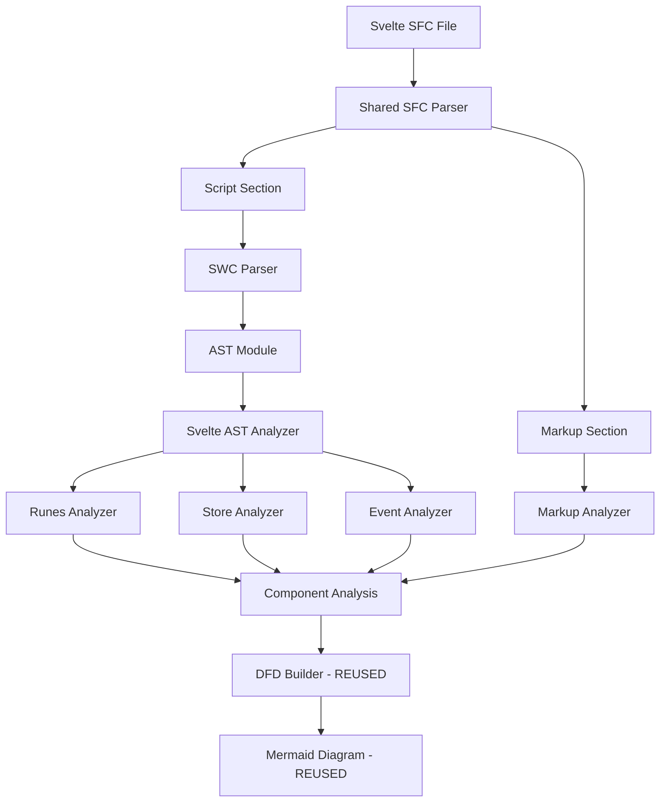
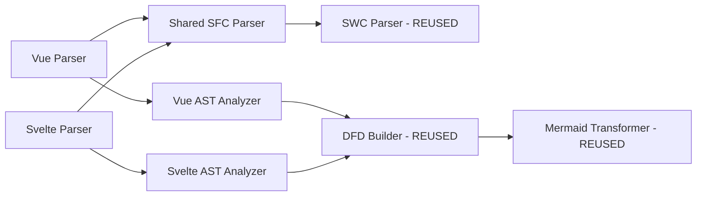

# Design Document

## Overview

This design document outlines the architecture for adding Svelte 5 runes API support to the web-component-analyzer extension. The implementation will maximize code reuse from the existing Vue parser infrastructure by creating shared utilities for SFC extraction and AST analysis. The design focuses exclusively on Svelte 5's new runes API ($state, $derived, $effect, $props) and will support SvelteKit routing patterns.

## Architecture

### High-Level Architecture

```
┌─────────────────────────────────────────────────────────────┐
│                    Extension Entry Point                     │
│              (packages/extension/src/extension.ts)           │
└────────────────────────────┬────────────────────────────────┘
                             │
                             ▼
┌─────────────────────────────────────────────────────────────┐
│                   Framework Detection                        │
│      (Detect .svelte files and route to Svelte parser)      │
└────────────────────────────┬────────────────────────────────┘
                             │
                             ▼
┌─────────────────────────────────────────────────────────────┐
│              Shared SFC Parser (NEW - SHARED)                │
│    (Extract <script> and markup sections for Vue/Svelte)    │
│         packages/analyzer/src/parser/sfc-parser.ts           │
└────────────────────────────┬────────────────────────────────┘
                             │
                             ▼
┌─────────────────────────────────────────────────────────────┐
│                    SWC TypeScript Parser                     │
│         (Parse script content to AST - REUSED)               │
└────────────────────────────┬────────────────────────────────┘
                             │
                             ▼
┌─────────────────────────────────────────────────────────────┐
│                    Svelte AST Analyzer                       │
│         (Analyze Svelte 5 runes patterns)                    │
│  ┌──────────────────────────────────────────────────────┐   │
│  │  - Runes Analyzer ($props, $state, $derived, $effect)│   │
│  │  - Store Analyzer (writable, readable, derived)      │   │
│  │  - Event Analyzer (createEventDispatcher)            │   │
│  │  - Markup Analyzer (bindings, directives)            │   │
│  └──────────────────────────────────────────────────────┘   │
└────────────────────────────┬────────────────────────────────┘
                             │
                             ▼
┌─────────────────────────────────────────────────────────────┐
│         Library Adapters (Processor Registry - REUSED)       │
│  ┌──────────────────────────────────────────────────────┐   │
│  │  - SvelteKit Processor ($app/stores, goto)           │   │
│  │  - Svelte Store Processor (writable, derived)        │   │
│  └──────────────────────────────────────────────────────┘   │
└────────────────────────────┬────────────────────────────────┘
                             │
                             ▼
┌─────────────────────────────────────────────────────────────┐
│                DFD Builder (REUSED)                          │
│         (Generate nodes, edges, and subgraphs)               │
└────────────────────────────┬────────────────────────────────┘
                             │
                             ▼
┌─────────────────────────────────────────────────────────────┐
│                Mermaid Transformer (REUSED)                  │
│         (Convert DFD to Mermaid diagram)                     │
└─────────────────────────────────────────────────────────────┘
```

### Code Reuse Strategy

**Shared Components (NEW)**:
1. `sfc-parser.ts` - Extract script/markup sections (Vue + Svelte)
2. `template-analyzer-base.ts` - Common template parsing logic

**Reused Components**:
1. SWC TypeScript/JavaScript parser
2. Type classification service
3. Library detection infrastructure
4. Processor registry pattern
5. DFD builder
6. Mermaid transformer

**Svelte-Specific Components (NEW)**:
1. `svelte-ast-analyzer.ts` - Svelte runes detection
2. `svelte-runes-analyzer.ts` - $state, $derived, $effect, $props
3. `svelte-markup-analyzer.ts` - Svelte template syntax
4. `sveltekit.ts` - SvelteKit library adapter

## Components and Interfaces

### Shared SFC Parser (NEW - Refactored from Vue)

```typescript
// packages/analyzer/src/parser/sfc-parser.ts

export interface SFCSection {
  content: string;
  lang?: string;
  line: number;
  column: number;
}

export interface ParsedSFC {
  script?: SFCSection;
  template?: SFCSection;
  styles?: SFCSection[];
}

export interface SFCParserOptions {
  scriptTag?: string;      // 'script' for Svelte, 'script setup' for Vue
  templateTag?: string;     // 'markup' for Svelte, 'template' for Vue
}

/**
 * Shared SFC parser for Vue and Svelte
 * Extracts script, template/markup, and style sections
 */
export class SFCParser {
  /**
   * Parse an SFC file and extract sections
   * @param source - SFC source code
   * @param options - Parser options for framework-specific tags
   * @returns Parsed sections
   */
  parse(source: string, options?: SFCParserOptions): ParsedSFC;
  
  /**
   * Extract script section
   * @param source - SFC source code
   * @param scriptTag - Tag name to look for
   * @returns Script section or null
   */
  private extractScript(source: string, scriptTag: string): SFCSection | null;
  
  /**
   * Extract template/markup section
   * @param source - SFC source code
   * @param templateTag - Tag name to look for
   * @returns Template section or null
   */
  private extractTemplate(source: string, templateTag: string): SFCSection | null;
}
```

### Svelte AST Analyzer

```typescript
// packages/analyzer/src/parser/svelte-ast-analyzer.ts

export class SvelteASTAnalyzer implements ASTAnalyzer {
  private runesAnalyzer: SvelteRunesAnalyzer;
  private storeAnalyzer: SvelteStoreAnalyzer;
  private eventAnalyzer: SvelteEventAnalyzer;
  private markupAnalyzer: SvelteMarkupAnalyzer;
  
  constructor(typeResolver?: TypeResolver);
  
  /**
   * Analyze a Svelte component from parsed SFC
   * @param sfc - Parsed Svelte SFC
   * @param filePath - File path for type resolution
   * @returns Component analysis
   */
  async analyze(
    sfc: ParsedSFC,
    filePath?: string
  ): Promise<ComponentAnalysis | null>;
  
  /**
   * Analyze script section for runes and patterns
   * @param module - Parsed AST module
   * @param filePath - File path
   * @returns Script analysis
   */
  private async analyzeScript(
    module: swc.Module,
    filePath?: string
  ): Promise<ScriptAnalysis>;
  
  /**
   * Analyze markup section
   * @param markup - Markup content
   * @param scriptAnalysis - Script analysis for context
   * @returns Markup analysis
   */
  private analyzeMarkup(
    markup: string,
    scriptAnalysis: ScriptAnalysis
  ): MarkupAnalysis;
}
```

### Svelte Runes Analyzer

```typescript
// packages/analyzer/src/analyzers/svelte-runes-analyzer.ts

export interface RuneInfo {
  name: string;
  type: 'state' | 'derived' | 'effect' | 'props';
  dataType?: string;
  line?: number;
  column?: number;
}

export class SvelteRunesAnalyzer {
  /**
   * Analyze Svelte 5 runes in the component
   * @param statements - AST statements
   * @param typeResolver - Type resolver
   * @returns Array of rune definitions
   */
  analyzeRunes(
    statements: swc.Statement[],
    typeResolver?: TypeResolver
  ): Promise<RuneInfo[]>;
  
  /**
   * Detect $state() rune calls
   * @param statements - AST statements
   * @returns State rune info
   */
  private detectStateRunes(statements: swc.Statement[]): RuneInfo[];
  
  /**
   * Detect $derived() rune calls
   * @param statements - AST statements
   * @returns Derived rune info
   */
  private detectDerivedRunes(statements: swc.Statement[]): RuneInfo[];
  
  /**
   * Detect $effect() rune calls
   * @param statements - AST statements
   * @returns Effect rune info
   */
  private detectEffectRunes(statements: swc.Statement[]): RuneInfo[];
  
  /**
   * Detect $props() rune calls
   * @param statements - AST statements
   * @returns Props rune info
   */
  private detectPropsRunes(statements: swc.Statement[]): RuneInfo[];
}
```

### Svelte Markup Analyzer

```typescript
// packages/analyzer/src/analyzers/svelte-markup-analyzer.ts

export interface MarkupBinding {
  type: 'expression' | 'bind' | 'on' | 'class' | 'style';
  variable: string;
  target?: string;
  line?: number;
  column?: number;
}

export class SvelteMarkupAnalyzer {
  /**
   * Parse Svelte markup and extract bindings
   * @param markup - Markup HTML string
   * @returns Array of markup bindings
   */
  analyzeMarkup(markup: string): MarkupBinding[];
  
  /**
   * Extract expression bindings {variable}
   */
  private extractExpressionBindings(markup: string): MarkupBinding[];
  
  /**
   * Extract bind: directive bindings
   */
  private extractBindDirectives(markup: string): MarkupBinding[];
  
  /**
   * Extract on: event bindings
   */
  private extractOnDirectives(markup: string): MarkupBinding[];
  
  /**
   * Extract class: and style: bindings
   */
  private extractClassStyleDirectives(markup: string): MarkupBinding[];
}
```

### Library Adapters

#### SvelteKit Adapter

```typescript
// packages/analyzer/src/libraries/sveltekit.ts

export const svelteKitProcessor: HookProcessor = {
  metadata: {
    id: 'sveltekit',
    libraryName: 'sveltekit',
    packagePatterns: ['@sveltejs/kit'],
    hookNames: ['page', 'navigating', 'updated'],
    priority: 50,
  },
  
  shouldHandle(hook: HookInfo, context: ProcessorContext): boolean {
    // Handle $app/stores imports
    return hook.source === '$app/stores' || hook.source === '$app/navigation';
  },
  
  process(hook: HookInfo, context: ProcessorContext): ProcessorResult {
    // Create library hook node
    // Create external entity input nodes for $page, $navigating, etc.
    // Create edges from stores to consuming code
  }
};
```

#### Svelte Store Adapter

```typescript
// packages/analyzer/src/libraries/svelte-store.ts

export const svelteStoreProcessor: HookProcessor = {
  metadata: {
    id: 'svelte-store',
    libraryName: 'svelte/store',
    packagePatterns: ['svelte'],
    hookNames: ['writable', 'readable', 'derived', 'get'],
    priority: 50,
  },
  
  shouldHandle(hook: HookInfo, context: ProcessorContext): boolean {
    return hook.source === 'svelte/store';
  },
  
  process(hook: HookInfo, context: ProcessorContext): ProcessorResult {
    // Create library hook node for store creation
    // Detect auto-subscriptions ($store syntax)
    // Create external entity input nodes for subscriptions
    // Create edges for data flow
  }
};
```

## Data Models

### Component Analysis Extension

The existing `ComponentAnalysis` interface will be extended to support Svelte-specific data:

```typescript
export interface ComponentAnalysis {
  componentName: string;
  componentType: 'functional' | 'class' | 'vue-script-setup' | 'svelte-runes'; // Add Svelte type
  props: PropInfo[];
  hooks: HookInfo[];
  processes: ProcessInfo[];
  jsxOutput: JSXInfo;
  atomDefinitions?: AtomDefinition[];
  
  // Svelte-specific additions
  svelteRunes?: RuneInfo[];
  svelteStores?: StoreInfo[];
  svelteMarkup?: MarkupAnalysis;
}
```

### DFD Node Types

Svelte-specific node types will be added:

```typescript
type DFDNodeType = 
  | 'external_entity_input'
  | 'external_entity_output'
  | 'process'
  | 'data_store'
  | 'library_hook'
  | 'svelte_state'      // New: $state() rune
  | 'svelte_derived'    // New: $derived() rune
  | 'svelte_effect'     // New: $effect() rune
  | 'svelte_props'      // New: $props() rune
  | 'svelte_store';     // New: writable/readable store
```

## Error Handling

### Error Types

1. **SFC Parsing Errors**
   - Invalid SFC structure
   - Missing script section
   - Malformed markup

2. **Runes Analysis Errors**
   - Invalid rune syntax
   - Unsupported rune patterns
   - Type resolution failures

3. **Library Detection Errors**
   - Missing library imports
   - Incompatible library versions

### Error Handling Strategy

```typescript
export class SvelteAnalysisError extends Error {
  constructor(
    public code: string,
    public line?: number,
    public column?: number,
    message?: string
  ) {
    super(message);
    this.name = 'SvelteAnalysisError';
  }
}

// Error codes
export enum SvelteErrorCode {
  INVALID_SFC = 'INVALID_SFC',
  MISSING_SCRIPT = 'MISSING_SCRIPT',
  PARSE_ERROR = 'PARSE_ERROR',
  UNSUPPORTED_RUNE = 'UNSUPPORTED_RUNE',
  TYPE_RESOLUTION_FAILED = 'TYPE_RESOLUTION_FAILED',
}
```

Errors will be:
- Logged with context (file, line, column)
- Displayed in VS Code as diagnostics
- Gracefully handled to prevent extension crashes
- Reported with actionable messages

## Testing Strategy

### Unit Tests

1. **Shared SFC Parser Tests**
   - Test script extraction for both Vue and Svelte
   - Test template/markup extraction
   - Test TypeScript and JavaScript variants
   - Test error cases (malformed SFC)

2. **Svelte Runes Analyzer Tests**
   - Test $state() detection
   - Test $derived() detection
   - Test $effect() detection
   - Test $props() detection

3. **Library Adapter Tests**
   - Test SvelteKit store detection
   - Test Svelte store detection
   - Test auto-subscription detection

### Acceptance Tests

Following the existing acceptance test pattern:

1. **Create Test Components** (`examples/svelte-vite/src/components/`)
   - `001-SimpleProps.svelte` - $props() rune
   - `002-ReactiveState.svelte` - $state() rune
   - `003-DerivedValues.svelte` - $derived() rune
   - `004-Effects.svelte` - $effect() rune
   - `005-Stores.svelte` - writable/readable stores
   - `006-AutoSubscription.svelte` - $store syntax
   - `007-SvelteKit.svelte` - $page, goto()
   - `008-EventDispatch.svelte` - createEventDispatcher
   - `009-MarkupBindings.svelte` - bind:, on:, class:
   - `010-ControlFlow.svelte` - {#if}, {#each}, {#await}

2. **Create Reference Files**
   - Each component has a corresponding `.mmd` file
   - Reference files contain expected Mermaid output
   - Tests compare generated output against references

3. **Test Execution**
   - Run acceptance tests: `npm run test`
   - Update references: `npm run test -- --update-refs`
   - Filter tests: `npm run test -- --filter=svelte`

### Integration Tests

1. **Extension Integration**
   - Test .svelte file detection
   - Test command execution on Svelte files
   - Test webview rendering
   - Test error display

2. **Code Reuse Validation**
   - Verify shared SFC parser works for both Vue and Svelte
   - Verify library detection works for Svelte libraries
   - Verify DFD builder handles Svelte nodes correctly

## Implementation Phases

### Phase 1: Shared Infrastructure (Foundation)

**Goal**: Refactor Vue parser to create shared utilities

**Tasks**:
1. Extract SFC parsing logic from Vue parser into shared `sfc-parser.ts`
2. Update Vue parser to use shared SFC parser
3. Create base template analyzer interface
4. Add Svelte file detection to framework detector
5. Verify Vue functionality still works

**Deliverables**:
- Shared SFC parser working for Vue
- No regression in Vue functionality
- Svelte file detection active

### Phase 2: Svelte Runes Support

**Goal**: Implement Svelte 5 runes API detection

**Tasks**:
1. Create Svelte AST analyzer
2. Implement $state() rune detection
3. Implement $derived() rune detection
4. Implement $effect() rune detection
5. Implement $props() rune detection
6. Add basic acceptance tests

**Deliverables**:
- All runes detected correctly
- 4-5 acceptance tests passing

### Phase 3: Svelte Stores Support

**Goal**: Support Svelte store patterns

**Tasks**:
1. Create Svelte store analyzer
2. Detect writable/readable/derived stores
3. Detect auto-subscriptions ($store syntax)
4. Create Svelte store library adapter
5. Add store-focused acceptance tests

**Deliverables**:
- Store patterns detected
- Auto-subscriptions working
- 2-3 store acceptance tests passing

### Phase 4: Markup Analysis

**Goal**: Parse and analyze Svelte markup

**Tasks**:
1. Create Svelte markup analyzer
2. Detect expression bindings {variable}
3. Detect bind: directives
4. Detect on: event directives
5. Detect class: and style: directives
6. Create data flows from markup to script

**Deliverables**:
- Markup analysis working
- Markup bindings in DFD
- 2-3 markup-focused acceptance tests

### Phase 5: SvelteKit Support

**Goal**: Support SvelteKit routing and navigation

**Tasks**:
1. Create SvelteKit library adapter
2. Detect $app/stores usage ($page, $navigating, etc.)
3. Detect goto() navigation
4. Add SvelteKit-focused acceptance tests
5. Document SvelteKit support

**Deliverables**:
- SvelteKit support complete
- 2-3 SvelteKit acceptance tests passing

### Phase 6: Polish and Documentation

**Goal**: Production-ready Svelte support

**Tasks**:
1. Error handling improvements
2. Performance optimization
3. Documentation updates
4. User guide for Svelte support
5. Example Svelte project setup

**Deliverables**:
- Comprehensive error messages
- Performance benchmarks
- Complete documentation
- Example Svelte project

## Design Decisions and Rationales

### Decision 1: Shared SFC Parser

**Decision**: Refactor Vue SFC parser into a shared utility for both Vue and Svelte

**Rationale**:
- Both frameworks use similar SFC structure (script, template/markup, styles)
- Reduces code duplication
- Easier to maintain and test
- Consistent parsing behavior

**Trade-offs**:
- Requires refactoring existing Vue code
- Must support both framework's tag naming conventions
- Slightly more complex API

### Decision 2: Focus on Runes API Only

**Decision**: Support only Svelte 5 runes API, not legacy reactive syntax

**Rationale**:
- Runes are the future of Svelte
- Simpler implementation (one pattern to support)
- Aligns with Svelte 5 best practices
- User requirement

**Trade-offs**:
- Cannot analyze legacy Svelte components
- May need to add legacy support later

### Decision 3: Reuse Processor Registry

**Decision**: Use the existing processor registry for Svelte library adapters

**Rationale**:
- Consistent with React and Vue library support
- Extensible for future Svelte libraries
- Clean separation of concerns
- Already tested and working

**Trade-offs**:
- Must understand processor architecture
- More boilerplate for simple libraries

### Decision 4: Lightweight Markup Parser

**Decision**: Create a regex-based markup parser for Svelte templates

**Rationale**:
- Svelte markup is HTML-like, similar to Vue templates
- Can reuse patterns from Vue template analyzer
- Don't need full HTML parser for basic bindings
- Keeps dependencies minimal

**Trade-offs**:
- May miss edge cases in complex templates
- Could use svelte/compiler but adds dependency

### Decision 5: DFD Format Compatibility

**Decision**: Use the same DFD format as React and Vue components

**Rationale**:
- Reuse existing Mermaid transformer
- Consistent visualization across frameworks
- No changes to webview rendering
- Easier maintenance

**Trade-offs**:
- Svelte-specific patterns must map to DFD concepts
- May lose some Svelte-specific nuances

## Performance Considerations

### Parsing Performance

- **SFC Extraction**: O(n) where n is file size
  - Use regex for section extraction (shared with Vue)
  - Cache parsed SFC structure

- **AST Parsing**: Handled by SWC (fast)
  - SWC is written in Rust, very performant
  - Parsing is typically < 100ms for typical components

- **Markup Parsing**: O(n) where n is markup size
  - Use regex for directive extraction
  - Avoid full HTML parsing
  - Cache markup analysis results

### Memory Usage

- **AST Storage**: Minimal
  - AST is traversed, not stored
  - Only extract needed information

- **Analysis Results**: Small
  - Store only DFD nodes and edges
  - Typical component: < 1KB of data

### Optimization Strategies

1. **Lazy Analysis**: Only analyze when visualization is requested
2. **Incremental Updates**: Re-analyze only changed sections
3. **Caching**: Cache parsed SFC and analysis results
4. **Debouncing**: Debounce file change events (300ms)
5. **Shared Code**: Reuse Vue infrastructure to reduce memory footprint

## Security Considerations

### Input Validation

- Validate SFC structure before parsing
- Sanitize markup content before analysis
- Limit file size (max 1MB)
- Timeout long-running analysis (5s)

### Code Execution

- Never execute user code
- Only parse and analyze statically
- No eval() or Function() calls
- Sandboxed markup parsing

### Dependency Security

- Use trusted parsers (SWC)
- Keep dependencies updated
- Audit library adapters
- No network requests during analysis

## Accessibility

The Svelte support will maintain the same accessibility standards as React and Vue support:

- Keyboard navigation in webview
- Screen reader support for diagrams
- High contrast theme support
- Accessible error messages
- ARIA labels on interactive elements

## Diagrams

### Svelte Component Analysis Flow



### Code Reuse Architecture



## Migration Path

For users with existing React and Vue projects:

1. **No Breaking Changes**: Svelte support is additive
2. **Separate Parsers**: React, Vue, and Svelte parsers are independent
3. **Shared Infrastructure**: SFC parser, DFD builder, and Mermaid transformer are shared
4. **Consistent UX**: Same commands and UI for all frameworks

## Future Enhancements

Potential future additions (not in scope for initial implementation):

1. **Legacy Syntax Support**: Add support for Svelte 4 reactive syntax ($:)
2. **Svelte Transitions**: Visualize transition and animation usage
3. **Svelte Actions**: Detect and visualize use: directives
4. **Component Slots**: Visualize slot usage and content projection
5. **Svelte Context**: Enhanced context API visualization
6. **Performance Profiling**: Add performance metrics to diagrams
7. **Interactive Diagrams**: Click to navigate to code
8. **Svelte Native**: Support for Svelte Native mobile components
