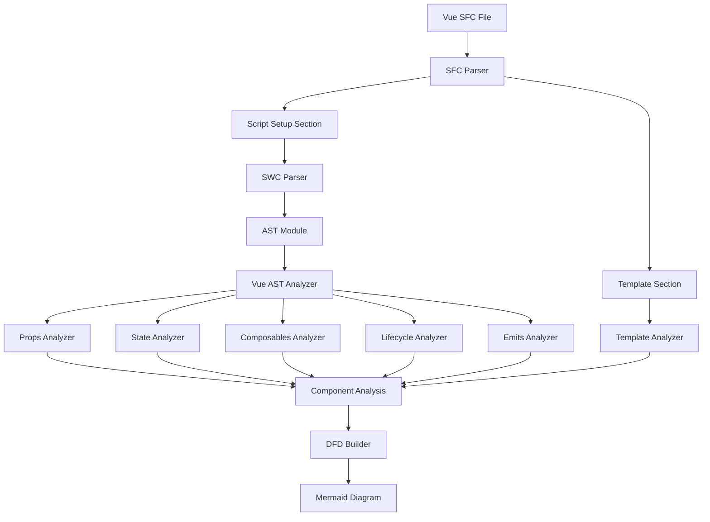
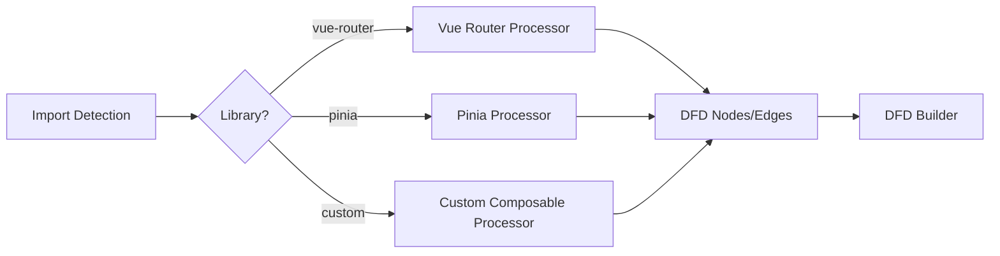

# Design Document

## Overview

This design document outlines the architecture for adding Vue 3 script setup support to the web-component-analyzer extension. The implementation will follow the existing analyzer architecture patterns used for React, adapting them to handle Vue Single File Components (SFC) with script setup syntax. The design includes support for Vue 3 Composition API primitives, Vue Router, and Pinia state management.

## Architecture

### High-Level Architecture

```
┌─────────────────────────────────────────────────────────────┐
│                    Extension Entry Point                     │
│              (packages/extension/src/extension.ts)           │
└────────────────────────────┬────────────────────────────────┘
                             │
                             ▼
┌─────────────────────────────────────────────────────────────┐
│                   Framework Detection                        │
│         (Detect .vue files and route to Vue parser)         │
└────────────────────────────┬────────────────────────────────┘
                             │
                             ▼
┌─────────────────────────────────────────────────────────────┐
│                    Vue SFC Parser                            │
│         (Extract <script setup> and <template>)              │
└────────────────────────────┬────────────────────────────────┘
                             │
                             ▼
┌─────────────────────────────────────────────────────────────┐
│                    SWC TypeScript Parser                     │
│         (Parse script setup content to AST)                  │
└────────────────────────────┬────────────────────────────────┘
                             │
                             ▼
┌─────────────────────────────────────────────────────────────┐
│                    Vue AST Analyzer                          │
│         (Analyze Vue-specific patterns)                      │
│  ┌──────────────────────────────────────────────────────┐   │
│  │  - Props Analyzer (defineProps)                      │   │
│  │  - State Analyzer (ref, reactive, computed)          │   │
│  │  - Composables Analyzer (use* functions)             │   │
│  │  - Lifecycle Analyzer (onMounted, etc.)              │   │
│  │  - Emits Analyzer (defineEmits)                      │   │
│  │  - Template Analyzer (v-bind, v-on, etc.)            │   │
│  └──────────────────────────────────────────────────────┘   │
└────────────────────────────┬────────────────────────────────┘
                             │
                             ▼
┌─────────────────────────────────────────────────────────────┐
│                Library Adapters (Processor Registry)         │
│  ┌──────────────────────────────────────────────────────┐   │
│  │  - Vue Router Processor (useRoute, useRouter)        │   │
│  │  - Pinia Processor (useStore, storeToRefs)           │   │
│  │  - Custom Composables Processor                      │   │
│  └──────────────────────────────────────────────────────┘   │
└────────────────────────────┬────────────────────────────────┘
                             │
                             ▼
┌─────────────────────────────────────────────────────────────┐
│                    DFD Builder                               │
│         (Generate nodes, edges, and subgraphs)               │
└────────────────────────────┬────────────────────────────────┘
                             │
                             ▼
┌─────────────────────────────────────────────────────────────┐
│                    Mermaid Transformer                       │
│         (Convert DFD to Mermaid diagram)                     │
└─────────────────────────────────────────────────────────────┘
```

### Component Structure

The implementation will be organized into the following components:

1. **Vue SFC Parser** (`packages/analyzer/src/parser/vue-sfc-parser.ts`)
   - Extract `<script setup>` content
   - Extract `<template>` content
   - Handle TypeScript and JavaScript variants
   - Preserve line/column information for error reporting

2. **Vue AST Analyzer** (`packages/analyzer/src/parser/vue-ast-analyzer.ts`)
   - Extend or adapt existing `SWCASTAnalyzer`
   - Detect Vue-specific patterns (defineProps, ref, reactive, etc.)
   - Coordinate with specialized analyzers

3. **Vue-Specific Analyzers** (`packages/analyzer/src/analyzers/vue-*.ts`)
   - `vue-props-analyzer.ts`: Handle defineProps() calls
   - `vue-state-analyzer.ts`: Handle ref(), reactive(), computed()
   - `vue-composables-analyzer.ts`: Handle composable calls
   - `vue-lifecycle-analyzer.ts`: Handle lifecycle hooks
   - `vue-emits-analyzer.ts`: Handle defineEmits()
   - `vue-template-analyzer.ts`: Parse template directives

4. **Library Adapters** (`packages/analyzer/src/libraries/`)
   - `vue-router.ts`: Handle useRoute(), useRouter(), navigation guards
   - `pinia.ts`: Handle useStore(), storeToRefs(), actions
   - `vue.ts`: Handle Vue core composables

5. **Integration Layer**
   - Update framework detection to recognize `.vue` files
   - Register Vue processors in the processor registry
   - Ensure DFD output format compatibility

## Components and Interfaces

### Vue SFC Parser

```typescript
// packages/analyzer/src/parser/vue-sfc-parser.ts

export interface VueSFCSection {
  content: string;
  lang?: string;
  line: number;
  column: number;
}

export interface ParsedVueSFC {
  script?: VueSFCSection;
  template?: VueSFCSection;
  styles?: VueSFCSection[];
}

export class VueSFCParser {
  /**
   * Parse a Vue SFC file and extract sections
   * @param source - Vue SFC source code
   * @returns Parsed sections
   */
  parse(source: string): ParsedVueSFC;
  
  /**
   * Extract script setup content
   * @param source - Vue SFC source code
   * @returns Script section or null
   */
  private extractScriptSetup(source: string): VueSFCSection | null;
  
  /**
   * Extract template content
   * @param source - Vue SFC source code
   * @returns Template section or null
   */
  private extractTemplate(source: string): VueSFCSection | null;
}
```

### Vue AST Analyzer

```typescript
// packages/analyzer/src/parser/vue-ast-analyzer.ts

export class VueASTAnalyzer implements ASTAnalyzer {
  private propsAnalyzer: VuePropsAnalyzer;
  private stateAnalyzer: VueStateAnalyzer;
  private composablesAnalyzer: VueComposablesAnalyzer;
  private lifecycleAnalyzer: VueLifecycleAnalyzer;
  private emitsAnalyzer: VueEmitsAnalyzer;
  private templateAnalyzer: VueTemplateAnalyzer;
  
  constructor(typeResolver?: TypeResolver);
  
  /**
   * Analyze a Vue component from parsed SFC
   * @param sfc - Parsed Vue SFC
   * @param filePath - File path for type resolution
   * @returns Component analysis
   */
  async analyze(
    sfc: ParsedVueSFC,
    filePath?: string
  ): Promise<ComponentAnalysis | null>;
  
  /**
   * Analyze script setup section
   * @param module - Parsed AST module
   * @param filePath - File path
   * @returns Script analysis
   */
  private async analyzeScriptSetup(
    module: swc.Module,
    filePath?: string
  ): Promise<ScriptAnalysis>;
  
  /**
   * Analyze template section
   * @param template - Template content
   * @param scriptAnalysis - Script analysis for context
   * @returns Template analysis
   */
  private analyzeTemplate(
    template: string,
    scriptAnalysis: ScriptAnalysis
  ): TemplateAnalysis;
}
```

### Vue Props Analyzer

```typescript
// packages/analyzer/src/analyzers/vue-props-analyzer.ts

export class VuePropsAnalyzer {
  /**
   * Analyze defineProps() calls
   * @param module - AST module
   * @param typeResolver - Type resolver
   * @returns Array of prop definitions
   */
  analyzeProps(
    module: swc.Module,
    typeResolver?: TypeResolver
  ): Promise<PropInfo[]>;
  
  /**
   * Extract props from defineProps<T>() generic syntax
   * @param typeAnnotation - Type annotation
   * @returns Array of prop definitions
   */
  private extractPropsFromGeneric(
    typeAnnotation: swc.TsType
  ): PropInfo[];
  
  /**
   * Extract props from defineProps({ ... }) object syntax
   * @param objectExpression - Object expression
   * @returns Array of prop definitions
   */
  private extractPropsFromObject(
    objectExpression: swc.ObjectExpression
  ): PropInfo[];
}
```

### Vue State Analyzer

```typescript
// packages/analyzer/src/analyzers/vue-state-analyzer.ts

export interface VueStateInfo {
  name: string;
  type: 'ref' | 'reactive' | 'computed';
  dataType: string;
  line?: number;
  column?: number;
}

export class VueStateAnalyzer {
  /**
   * Analyze reactive state declarations
   * @param statements - AST statements
   * @param typeResolver - Type resolver
   * @returns Array of state definitions
   */
  analyzeState(
    statements: swc.Statement[],
    typeResolver?: TypeResolver
  ): Promise<VueStateInfo[]>;
  
  /**
   * Detect ref() calls
   */
  private detectRefCalls(statements: swc.Statement[]): VueStateInfo[];
  
  /**
   * Detect reactive() calls
   */
  private detectReactiveCalls(statements: swc.Statement[]): VueStateInfo[];
  
  /**
   * Detect computed() calls
   */
  private detectComputedCalls(statements: swc.Statement[]): VueStateInfo[];
}
```

### Vue Template Analyzer

```typescript
// packages/analyzer/src/analyzers/vue-template-analyzer.ts

export interface TemplateBinding {
  type: 'mustache' | 'v-bind' | 'v-on' | 'v-model';
  variable: string;
  target?: string;
  line?: number;
  column?: number;
}

export class VueTemplateAnalyzer {
  /**
   * Parse Vue template and extract bindings
   * @param template - Template HTML string
   * @returns Array of template bindings
   */
  analyzeTemplate(template: string): TemplateBinding[];
  
  /**
   * Extract mustache bindings {{ variable }}
   */
  private extractMustacheBindings(template: string): TemplateBinding[];
  
  /**
   * Extract v-bind or : bindings
   */
  private extractVBindBindings(template: string): TemplateBinding[];
  
  /**
   * Extract v-on or @ bindings
   */
  private extractVOnBindings(template: string): TemplateBinding[];
  
  /**
   * Extract v-model bindings
   */
  private extractVModelBindings(template: string): TemplateBinding[];
}
```

### Library Adapters

#### Vue Router Adapter

```typescript
// packages/analyzer/src/libraries/vue-router.ts

export const vueRouterProcessor: HookProcessor = {
  metadata: {
    id: 'vue-router',
    libraryName: 'vue-router',
    packagePatterns: ['vue-router'],
    hookNames: ['useRoute', 'useRouter'],
    priority: 50,
  },
  
  shouldHandle(hook: HookInfo, context: ProcessorContext): boolean {
    return hook.hookName === 'useRoute' || hook.hookName === 'useRouter';
  },
  
  process(hook: HookInfo, context: ProcessorContext): ProcessorResult {
    // Create library hook node
    // Create external entity input nodes for route params/query
    // Create edges from route to consuming code
  }
};
```

#### Pinia Adapter

```typescript
// packages/analyzer/src/libraries/pinia.ts

export const piniaProcessor: HookProcessor = {
  metadata: {
    id: 'pinia',
    libraryName: 'pinia',
    packagePatterns: ['pinia'],
    hookNames: [/^use\w+Store$/],
    priority: 50,
  },
  
  shouldHandle(hook: HookInfo, context: ProcessorContext): boolean {
    // Match useXxxStore pattern
    return /^use\w+Store$/.test(hook.hookName);
  },
  
  process(hook: HookInfo, context: ProcessorContext): ProcessorResult {
    // Create library hook node for store
    // Create external entity input nodes for state/getters
    // Create process nodes for actions
    // Create edges for data flow
  }
};
```

## Data Models

### Component Analysis Extension

The existing `ComponentAnalysis` interface will be extended to support Vue-specific data:

```typescript
export interface ComponentAnalysis {
  componentName: string;
  componentType: 'functional' | 'class' | 'vue-script-setup'; // Add Vue type
  props: PropInfo[];
  hooks: HookInfo[];
  processes: ProcessInfo[];
  jsxOutput: JSXInfo;
  atomDefinitions?: AtomDefinition[];
  
  // Vue-specific additions
  vueState?: VueStateInfo[];
  vueEmits?: VueEmitInfo[];
  vueTemplate?: TemplateAnalysis;
}
```

### DFD Node Types

Vue-specific node types will be added:

```typescript
type DFDNodeType = 
  | 'external_entity_input'
  | 'external_entity_output'
  | 'process'
  | 'data_store'
  | 'library_hook'
  | 'vue_ref'           // New: ref() state
  | 'vue_reactive'      // New: reactive() state
  | 'vue_computed'      // New: computed() state
  | 'vue_emit'          // New: emit output
  | 'vue_composable';   // New: composable call
```

## Error Handling

### Error Types

1. **SFC Parsing Errors**
   - Invalid SFC structure
   - Missing script setup section
   - Malformed template

2. **AST Analysis Errors**
   - Invalid TypeScript/JavaScript syntax
   - Unsupported Vue patterns
   - Type resolution failures

3. **Library Detection Errors**
   - Missing library imports
   - Incompatible library versions

### Error Handling Strategy

```typescript
export class VueAnalysisError extends Error {
  constructor(
    public code: string,
    public line?: number,
    public column?: number,
    message?: string
  ) {
    super(message);
    this.name = 'VueAnalysisError';
  }
}

// Error codes
export enum VueErrorCode {
  INVALID_SFC = 'INVALID_SFC',
  MISSING_SCRIPT_SETUP = 'MISSING_SCRIPT_SETUP',
  PARSE_ERROR = 'PARSE_ERROR',
  UNSUPPORTED_PATTERN = 'UNSUPPORTED_PATTERN',
  TYPE_RESOLUTION_FAILED = 'TYPE_RESOLUTION_FAILED',
}
```

Errors will be:
- Logged with context (file, line, column)
- Displayed in VS Code as diagnostics
- Gracefully handled to prevent extension crashes
- Reported with actionable messages

## Testing Strategy

### Unit Tests

1. **Vue SFC Parser Tests**
   - Test script setup extraction
   - Test template extraction
   - Test TypeScript and JavaScript variants
   - Test error cases (malformed SFC)

2. **Vue Analyzer Tests**
   - Test defineProps detection
   - Test ref/reactive/computed detection
   - Test composable detection
   - Test lifecycle hook detection
   - Test emit detection

3. **Library Adapter Tests**
   - Test Vue Router hook detection
   - Test Pinia store detection
   - Test custom composable detection

### Acceptance Tests

Following the existing acceptance test pattern:

1. **Create Test Components** (`examples/vue-vite/src/components/`)
   - `001-SimpleProps.vue` - Basic props
   - `002-ReactiveState.vue` - ref/reactive
   - `003-ComputedValues.vue` - computed properties
   - `004-Composables.vue` - Custom composables
   - `005-Lifecycle.vue` - Lifecycle hooks
   - `006-Emits.vue` - Event emits
   - `007-VueRouter.vue` - Vue Router usage
   - `008-Pinia.vue` - Pinia store usage
   - `009-TemplateBindings.vue` - Template directives
   - `010-Watchers.vue` - Watchers

2. **Create Reference Files**
   - Each component has a corresponding `.mmd` file
   - Reference files contain expected Mermaid output
   - Tests compare generated output against references

3. **Test Execution**
   - Run acceptance tests: `npm run test`
   - Update references: `npm run test -- --update-refs`
   - Filter tests: `npm run test -- --filter=vue`

### Integration Tests

1. **Extension Integration**
   - Test .vue file detection
   - Test command execution on Vue files
   - Test webview rendering
   - Test error display

2. **End-to-End Tests**
   - Open Vue project in VS Code
   - Execute visualization command
   - Verify diagram generation
   - Test navigation features

## Implementation Phases

### Phase 1: Core Infrastructure (Foundation)

**Goal**: Set up basic Vue SFC parsing and AST analysis

**Tasks**:
1. Create Vue SFC parser
2. Create Vue AST analyzer
3. Integrate with framework detection
4. Add basic props analyzer (defineProps)
5. Add basic state analyzer (ref, reactive)
6. Create initial acceptance tests

**Deliverables**:
- Vue SFC parser working
- Basic component analysis working
- 2-3 acceptance tests passing

### Phase 2: Composition API Support

**Goal**: Full support for Vue 3 Composition API primitives

**Tasks**:
1. Implement computed() detection
2. Implement composable detection
3. Implement lifecycle hook detection
4. Implement emit detection (defineEmits)
5. Add comprehensive acceptance tests

**Deliverables**:
- All Composition API patterns detected
- 5-7 acceptance tests passing

### Phase 3: Template Analysis

**Goal**: Parse and analyze Vue templates

**Tasks**:
1. Create template parser
2. Detect mustache bindings
3. Detect v-bind/v-on directives
4. Detect v-model bindings
5. Create data flows from template to script

**Deliverables**:
- Template analysis working
- Template bindings in DFD
- 2-3 template-focused acceptance tests

### Phase 4: Library Adapters

**Goal**: Support Vue Router and Pinia

**Tasks**:
1. Implement Vue Router processor
2. Implement Pinia processor
3. Add library-specific acceptance tests
4. Document library support

**Deliverables**:
- Vue Router support complete
- Pinia support complete
- 2-4 library-focused acceptance tests

### Phase 5: Polish and Documentation

**Goal**: Production-ready Vue support

**Tasks**:
1. Error handling improvements
2. Performance optimization
3. Documentation updates
4. User guide for Vue support
5. Example project setup

**Deliverables**:
- Comprehensive error messages
- Performance benchmarks
- Complete documentation
- Example Vue project

## Design Decisions and Rationales

### Decision 1: Reuse SWC Parser

**Decision**: Use the existing SWC TypeScript/JavaScript parser for script setup content

**Rationale**:
- SWC already handles TypeScript and JavaScript
- No need for Vue-specific AST parser
- Consistent with React implementation
- Reduces dependencies

**Trade-offs**:
- Must extract script setup content first
- Cannot parse template with SWC (need separate parser)

### Decision 2: Separate Template Parser

**Decision**: Create a lightweight template parser for Vue templates

**Rationale**:
- Vue templates are HTML-like, not JavaScript
- Need to extract directives and bindings
- Can use regex-based parsing for simplicity
- Don't need full HTML parser

**Trade-offs**:
- Additional parser to maintain
- May miss edge cases in complex templates
- Could use vue-template-compiler but adds dependency

### Decision 3: Processor Registry Pattern

**Decision**: Use the existing processor registry for library adapters

**Rationale**:
- Consistent with React library support
- Extensible for future libraries
- Clean separation of concerns
- Easy to test individual processors

**Trade-offs**:
- Requires understanding processor architecture
- More boilerplate for simple libraries

### Decision 4: Script Setup Only

**Decision**: Support only Vue 3 script setup syntax, not Options API

**Rationale**:
- Script setup is the recommended Vue 3 approach
- Simpler implementation (one pattern to support)
- Aligns with modern Vue development
- User requirement

**Trade-offs**:
- Cannot analyze Options API components
- May need to add Options API support later

### Decision 5: DFD Format Compatibility

**Decision**: Use the same DFD format as React components

**Rationale**:
- Reuse existing Mermaid transformer
- Consistent visualization across frameworks
- No changes to webview rendering
- Easier maintenance

**Trade-offs**:
- Vue-specific patterns must map to DFD concepts
- May lose some Vue-specific nuances

## Performance Considerations

### Parsing Performance

- **SFC Extraction**: O(n) where n is file size
  - Use regex for section extraction
  - Cache parsed SFC structure

- **AST Parsing**: Handled by SWC (fast)
  - SWC is written in Rust, very performant
  - Parsing is typically < 100ms for typical components

- **Template Parsing**: O(n) where n is template size
  - Use regex for directive extraction
  - Avoid full HTML parsing
  - Cache template analysis results

### Memory Usage

- **AST Storage**: Minimal
  - AST is traversed, not stored
  - Only extract needed information

- **Analysis Results**: Small
  - Store only DFD nodes and edges
  - Typical component: < 1KB of data

### Optimization Strategies

1. **Lazy Analysis**: Only analyze when visualization is requested
2. **Incremental Updates**: Re-analyze only changed sections
3. **Caching**: Cache parsed SFC and analysis results
4. **Debouncing**: Debounce file change events (300ms)

## Security Considerations

### Input Validation

- Validate SFC structure before parsing
- Sanitize template content before analysis
- Limit file size (max 1MB)
- Timeout long-running analysis (5s)

### Code Execution

- Never execute user code
- Only parse and analyze statically
- No eval() or Function() calls
- Sandboxed template parsing

### Dependency Security

- Use trusted parsers (SWC)
- Keep dependencies updated
- Audit library adapters
- No network requests during analysis

## Accessibility

The Vue support will maintain the same accessibility standards as React support:

- Keyboard navigation in webview
- Screen reader support for diagrams
- High contrast theme support
- Accessible error messages
- ARIA labels on interactive elements

## Diagrams

### Vue Component Analysis Flow



### Library Adapter Integration



## Migration Path

For users with existing React projects:

1. **No Breaking Changes**: Vue support is additive
2. **Separate Parsers**: React and Vue parsers are independent
3. **Shared Infrastructure**: DFD builder and Mermaid transformer are shared
4. **Consistent UX**: Same commands and UI for both frameworks

## Future Enhancements

Potential future additions (not in scope for initial implementation):

1. **Options API Support**: Add support for Vue 2 Options API
2. **Vuex Support**: Add Vuex state management adapter
3. **Nuxt.js Support**: Add Nuxt-specific patterns
4. **Vue 2 Support**: Add Vue 2 Composition API support
5. **Template Type Checking**: Integrate with Volar for template types
6. **Component Props Validation**: Validate prop usage in templates
7. **Performance Profiling**: Add performance metrics to diagrams
8. **Interactive Diagrams**: Click to navigate to code
