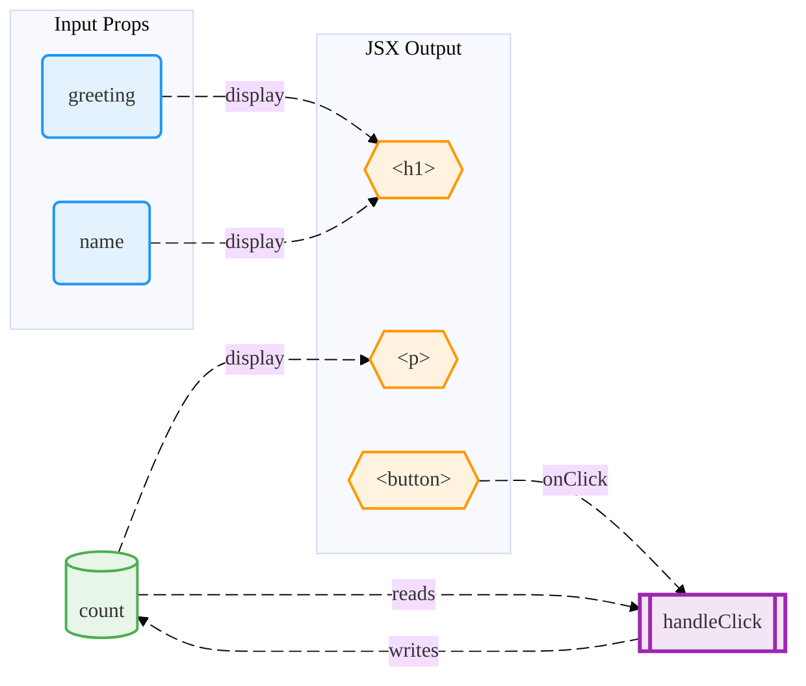

# Web Component Analyzer

Visualize the internal structure of frontend components through Data Flow Diagrams (DFD) like the following mermaid.js style.

You can try it without installing on the [playground](https://shibukawa.github.io/web-component-analyzer/) site.

## How To Use

Install extension

Launch command `Show Component DFD` from command palette.

## Supported Frameworks

* React
  * Router
    * Next.js
    * TanStack Router
    * React Router
  * Query
    * SWR
    * TanStack Query
    * Apollo
    * tRPC
  * Data Store
    * Zustand
    * Jotai
    * MobX
  * From
    * React Hook Form
* Vue 3 (Composition API with `<script setup>`)
  * Vue Router
  * Pinia
* Svelte5
  * SvelteKit router

## License

Apache2

## Known Issues

* DFD nodes are clickable and navigate to source code positions. But locations are sometimes wrong.  